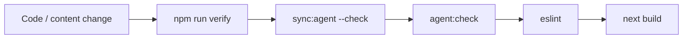

# Automation — zero-reminder agent workflow

All chores run automatically or via a **single command**: `npm run verify`.

## Pipeline

| Step | Script | What it does |
|------|--------|----------------|
| 1 | `sync:agent --check` | Routes in `llms.txt` + `AGENTS.md` match `JARVIS_MODULES`; page files exist |
| 2 | `agent:check` | Required agent doc files present |
| 3 | `lint` | ESLint entire repo |
| 4 | `build` | Next.js production build |

Write mode (updates files): `npm run sync:agent` — runs on **every git commit** via Husky.

## Git hooks (Husky)

| Hook | Commands |
|------|----------|
| **pre-commit** | `sync:agent` → `agent:check` → `lint-staged` |
| **pre-push** | `npm run verify` |

Install hooks after clone: `npm install` (runs `prepare` → Husky).

## CI (GitHub Actions)

Workflow: `.github/workflows/ci.yml`

1. **verify** — `npm run verify` + fails if `llms.txt`, `AGENTS.md`, or `manifest.json` drift
2. **perf** — `npm run perf:full` + uploads `perf-reports/latest.*` artifact

## npm scripts

| Script | When to use |
|--------|-------------|
| `npm run verify` | **Always** before agent/human handoff |
| `npm run verify:ci` | Local full check including Lighthouse |
| `npm run sync:agent` | After changing routes or package scripts (auto on commit) |
| `npm run agent:check` | Doc file presence only |

## Generated files (commit with route/script changes)

- `docs/generated/manifest.json` — machine-readable routes + scripts
- `llms.txt` — routes section between `AGENT-SYNC:ROUTES` markers
- `AGENTS.md` — scripts table between `AGENT-SYNC:SCRIPTS` markers

**Do not edit markers manually** — run `npm run sync:agent`.

## Agent rules

Cursor: `.cursor/rules/automation.mdc` (always on) — mandates `npm run verify` before completion.

Copilot: `.github/copilot-instructions.md` points here.

## Adding a route (automated checklist)

1. Edit `lib/jarvis/constants.js` (`JARVIS_MODULES`)
2. Add `app/.../page.js` + `*Content.js`
3. Run `npm run verify` — sync updates docs; fix lint/build errors
4. Commit **including** synced `llms.txt`, `AGENTS.md`, `manifest.json`
