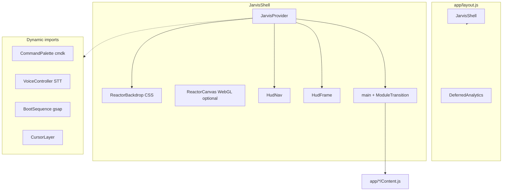

# Architecture — portfolio-web

## High-level diagram

## Routing (App Router)

| Route | `page.js` | Client content |
|-------|-----------|----------------|
| `/` | `app/page.js` | `app/home/HomeContent.js` |
| `/skills` | `app/skills/page.js` | `SkillsContent.js` |
| `/about` | `app/about/page.js` | `AboutContent.js` |
| `/projects` | `app/projects/page.js` | `ProjectsContent.js` |
| `/contact` | `app/contact/page.js` | `ContactContent.js` |

Pages use `next/dynamic` + `PageFallback` for code splitting.

## State (`JarvisProvider`)

| State | Purpose |
|-------|---------|
| `booting` / `bootComplete` | First-visit boot sequence (`sessionStorage`) |
| `voiceEnabled` / `voiceConsent` | Voice layer (`localStorage`) |
| `paletteOpen` / `helpOpen` | Overlays |
| `sfxMuted` | UI sounds |
| `transcript` / `listening` | Voice HUD |
| `use3D` | WebGL backdrop (opt-in + hardware check) |
| `isMobile` / `reduceMotion` | Capability gates |

Init: `JarvisInit.js` (layout effect, reads storage + media queries).

## Voice flow

1. User grants consent → `VoiceController` starts `SpeechRecognition` (continuous).
2. Final transcript → `matchIntent()` in `lib/jarvis/intents.js`.
3. Actions: `router.push`, `speechSynthesis`, toggle SFX, open palette/help.
4. Unknown intents: update transcript only (no TTS loop).

## Keyboard (`lib/jarvis/keyboard.js`)

Global listener in `JarvisShell`: ⌘K palette, shortcuts 1–5 for modules, `?` help, voice toggles.

## Styling layers

1. `globals.css` — imports + Tailwind
2. `styles/base.css` — design tokens
3. `styles/jarvis/*.css` — HUD, modules, pages, palette
4. Legacy `styles/*.css` — shared cards, buttons (pre-JARVIS)

## Performance model

- **LCP:** fonts + hero `h1`; keep shell JS small.
- **TBT:** defer typewriter, lazy gesture/GSAP on home.
- **Bundle:** shared ~800KB+ chunk (React/Next); route chunks for module pages.
- **Audit:** `scripts/perf-report.mjs` (Lighthouse + chunk sizes).

## External services

- **Formspree** — contact form POST (`lib/site-content.js` endpoint)
- **Vercel Analytics / Speed Insights** — `DeferredAnalytics.js`

## Extension points

- New module: `JARVIS_MODULES` + route + `ModulePage` content
- New voice command: `intents.js` + optional `commands.js`
- New SFX: `AudioController.js` Web Audio buffers
