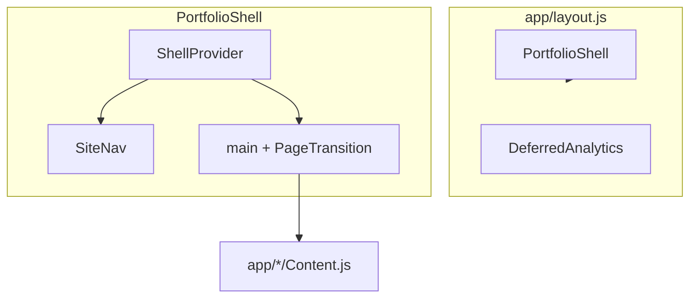

# Architecture — portfolio-web

## High-level diagram

## Routing (App Router)

| Route | `page.js` | Client content |
|-------|-----------|----------------|
| `/` | `app/page.js` | `app/home/HomeContent.js` |
| `/skills` | `app/skills/page.js` | `SkillsContent.js` |
| `/about` | `app/about/page.js` | `AboutContent.js` |
| `/projects` | `app/projects/page.js` | `ProjectsContent.js` |
| `/contact` | `app/contact/page.js` | `ContactContent.js` |

Pages use `next/dynamic` + `PageFallback` for code splitting.

## State (`ShellProvider`)

| State | Purpose |
|-------|---------|
| `isMobile` / `reduceMotion` | Capability gates |

## Styling layers

1. `globals.css` — imports + Tailwind
2. `styles/base.css` — design tokens
3. `styles/shell/*.css` — shell, modules, pages
4. `styles/*.css` — shared cards, buttons, typography

## Performance model

- **LCP:** fonts + hero `h1`; keep shell JS small.
- **TBT:** avoid always-on animation libraries and browser-only effects in the shell.
- **Bundle:** React/Next shared chunk plus route chunks for module pages.
- **Audit:** `scripts/perf-report.mjs` (Lighthouse + chunk sizes).

## External services

- **Formspree** — contact form POST (`lib/site-content.js` endpoint)
- **Vercel Analytics / Speed Insights** — `DeferredAnalytics.js`

## Extension points

- New module: `SITE_ROUTES` + route + `ModulePage` content
