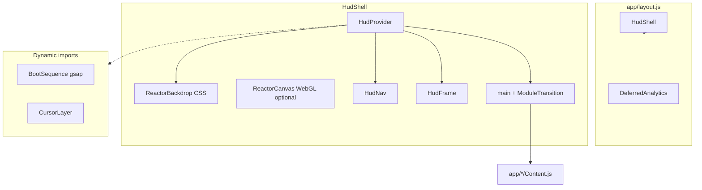

# Architecture — portfolio-web

## High-level diagram

## Routing (App Router)

| Route | `page.js` | Client content |
|-------|-----------|----------------|
| `/` | `app/page.js` | `app/home/HomeContent.js` |
| `/skills` | `app/skills/page.js` | `SkillsContent.js` |
| `/about` | `app/about/page.js` | `AboutContent.js` |
| `/projects` | `app/projects/page.js` | `ProjectsContent.js` |
| `/contact` | `app/contact/page.js` | `ContactContent.js` |

Pages use `next/dynamic` + `PageFallback` for code splitting.

## State (`HudProvider`)

| State | Purpose |
|-------|---------|
| `booting` / `bootComplete` | First-visit boot sequence (`sessionStorage`) |
| `sfxMuted` | UI sounds |
| `use3D` | WebGL backdrop (opt-in + hardware check) |
| `isMobile` / `reduceMotion` | Capability gates |

Init: `HudInit.js` (layout effect, reads storage + media queries).

## Styling layers

1. `globals.css` — imports + Tailwind
2. `styles/base.css` — design tokens
3. `styles/hud/*.css` — HUD, modules, pages
4. Legacy `styles/*.css` — shared cards, buttons (pre-HUD)

## Performance model

- **LCP:** fonts + hero `h1`; keep shell JS small.
- **TBT:** defer typewriter, lazy gesture/GSAP on home.
- **Bundle:** shared ~800KB+ chunk (React/Next); route chunks for module pages.
- **Audit:** `scripts/perf-report.mjs` (Lighthouse + chunk sizes).

## External services

- **Formspree** — contact form POST (`lib/site-content.js` endpoint)
- **Vercel Analytics / Speed Insights** — `DeferredAnalytics.js`

## Extension points

- New module: `HUD_MODULES` + route + `ModulePage` content
- New SFX: `AudioController.js` Web Audio buffers
